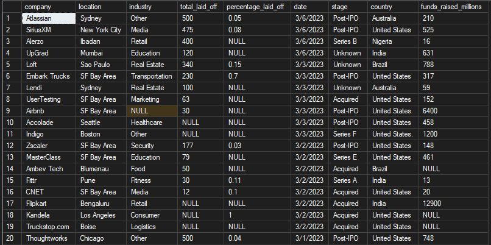
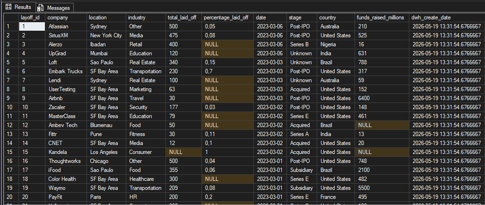
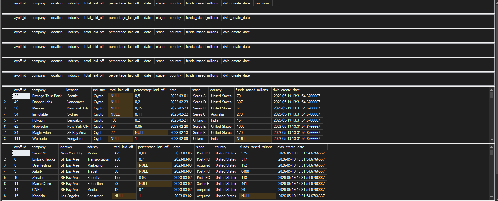

# SQL Data Warehouse Project – Layoffs Analysis

A SQL Server portfolio project focused on building a small but realistic data warehouse for layoffs data using a `Bronze` → `Silver` architecture.
The project loads raw CSV data, cleans and standardizes it, removes duplicates, applies quality checks, and stores the final result in an analytics-ready table.

## ✨ Project Overview
This project demonstrates an end-to-end SQL data warehouse workflow:
1. `Bronze layer` stores the raw source data exactly as it appears in the CSV file.
2. `Silver staging layer` is used for cleaning, standardization, and duplicate removal.
3. `Silver final layer` stores the cleaned data with proper data types and a primary key.
4. `Quality checks` validate the final data after loading.

The goal of the project is to show a practical ETL-style workflow that is easy to understand, easy to maintain, and suitable for a portfolio

---

## 🧱 Architecture

### Bronze Layer
The Bronze layer contains the raw untouched data loaded from the CSV file.
- All columns are stored as text (`NVARCHAR`)
- No business transformations are applied
- This layer preserves the original source data

### Silver Layer
The Silver layer contains cleaned and standardized data.
- Removes duplicates
- Trims whitespace
- Converts string `'NULL'` values to real `NULL`
- Standardizes values such as `Crypto%` → `Crypto`
- Fills missing industry values where possible
- Removes rows with no layoffs information
- Loads the final typed table

### Quality Checks
After loading, the project runs validation queries to confirm:
- no duplicate rows remain
- no unwanted spaces remain
- values are standardized
- missing industry values are expected and documented
- rows with no layoff information were removed

---

## 📂 Project Structure

```text
sql-data-warehouse-project/
├── dataset/
│   └── layoffs.csv
│
├── docs/
│   └── images/
│       ├── bronze_table_after_load.png
│       ├── final_silver_table.png
│       └── quality_checks.png
│
├── scripts/
│   ├── init_database.sql
│   ├── bronze/
│   │   ├── ddl_bronze.sql
│   │   └── proc_load_bronze.sql
│   └── silver/
│       ├── ddl_silver.sql
│       ├── proc_load_silver.sql
│       └── quality_checks_silver.sql
└── README.md
```

---

## 🗃️ Tables

### Bronze
`bronze.layoffs`
- Raw source table
- All columns are stored as `NVARCHAR`

### Silver Staging
`silver.layoffs_staging`
- Temporary cleaning table
- Used for transformations and duplicate handling
- Still stored mostly as text for safer cleanup

### Silver Final
`silver.layoffs`
- Final analytics-ready table
- Contains proper data types
- Includes a surrogate key: `layoff_id`
- Includes a load timestamp column: `dwh_create_date`

---

## ⚙️ Stored Procedures

`bronze.load_bronze`
Loads the raw CSV file into `bronze.layoffs`.
- truncates the Bronze table first
- uses `BULK INSERT`
- keeps the data untouched

`silver.load_silver`
Performs the ETL process from Bronze to Silver
- loads raw data into `silver.layoffs_staging`
- removes duplicates with `ROW_NUMBER()`
- cleans whitespace and standardizes values
- fills missing industry values where possible
- removes rows with no layoffs information
- loads cleaned and typed data into `silver.layoffs`

---

## 🧼 Data Cleaning Logic
The project includes the following cleaning steps:
- Duplicate removal using `ROW_NUMBER()`
- Whitespace trimming using `TRIM()`
- String NULL handling using `NULLIF(..., 'NULL')`
- Industry normalization:
  - `Crypto%` → `Crypto`
- Country normalization:
  - `United States%` → `United States`
- Date conversion using `TRY_CONVERT(DATE, ...)`
- Numeric conversion using `TRY_CONVERT(...)`

---

## ✅ Quality Checks
The following validation queries are included after the Silver load:
- duplicate check
- whitespace check
- normalization check
- missing industry check
- rows with no layoffs information check

These checks help confirm the final table is clean and ready for analysis.

---

## 🛠️ Features
- SQL Server-based ETL pipeline
- `Bronze` and `Silver` warehouse layers
- Raw-to-clean data processing
- Duplicate detection and removal
- Standardization of text values
- Data quality checks
- Stored procedures for repeatable loading
- Portfolio-friendly structure with clear comments and sections

---

## 📸 Visuals

### Bronze table after load

This screenshot shows `bronze.layoffs` after load.



### Final Silver table

This screenshot shows the cleaned `silver.layoffs`.



### Quality checks output

This screenshot shows the quality checks output



---

## 🧩 Prerequisites
- Microsoft SQL Server
- SQL Server Management Studio (SSMS) or Azure Data Studio
- Permission to create databases, schemas, tables, and stored procedures
- Access to the `layoffs.csv` file

---

## 🚀 How to Run
1. Run `init_database.sql` to create the database and schemas.
2. Run `ddl_bronze.sql` to create the Bronze table.
3. Run `proc_load_bronze.sql` to create the Bronze loading procedure.
4. Execute `bronze.load_bronze` to load the raw CSV data.
5. Run `ddl_silver.sql` to create the Silver tables.
6. Run `proc_load_silver.sql` to create the Silver loading procedure.
7. Execute `silver.load_silver` to clean and load the data.
8. Run `quality_checks_silver.sql` to validate the final result.

---

## ⚠️ Important Note
The `BULK INSERT` file path in `bronze.load_bronze` is environment-specific.
Before running the project on your own machine, update the CSV path so it matches your local folder structure.

---

## 👨‍💻 Author
**Václav Benda**
